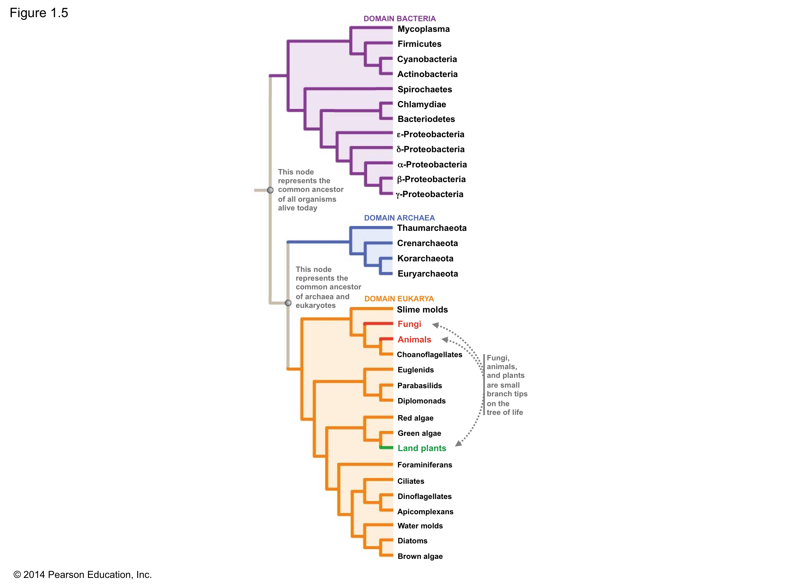

#Week 1    
• Intro – Basics Central dogma    
• Intro - Environmental challenges for living organisms     
• Intro - Environmental challenges for living organisms      
• Lab - Diversity (size and scale)      

Lecture theme option        
M LIFE       
W HOMEOSTASIS       
F External env.         

---
Ch1 58-67     
Ch 16      
Ch42 842-853      
Ch52 1059-1081       

---

"How life works"   

###Important Molecules
Water and other inorganics

*Organics*

- Carbohydrates
- Lipids
- Amino Acids (proteins)
- Nucleotides (nucleic acids)    

Two theories form the framework for modern biological science:     
*The cell theory*     
What are organisms made of?         
*The theory of evolution by natural selection*           
Where do organisms come from?       

In the late 1660s, Robert Hooke and Anton van Leeuwenhoek were the first to observe cells      
A cell is a highly organized compartment     
Bounded by a plasma membrane       
Containing concentrated chemicals in an aqueous solution     
The cell theory states that      
All organisms are made of cells (pattern)     
All cells come from preexisting cells (process)      

Prokaryotes - Eukaryotes - Domains of Life? Plants 

The tree of life indicates three major groups of organisms:         
The eukaryotes        
Eukarya        
Two groups of prokaryotes         
Bacteria and Archaea        

Cell Structure

Tissue 

Organisms - Plant life (show dramatic diversity in form, environments) 

###Homeostasis

Mechanistic explanation

_Topics_
   
• Bioenergetics     
• Energy acquisition - primary production and oxygen       
• Thermal Biology    
• Osmoregulation        
• Digestion and excretion    
• Sensory systems    
• Circulation and gas exchange    
• Defense   
• Reproduction    

********************************************************************************************************************
## INTRODUCTION TO AQUATIC ECOPHYSIOLOGY:

•	What´s aquatic physiology and why we do study it.    

•	Levels of organization. pp16, Ch 42, 849.   

•	How does body size affect animal physiology? Ch 45, pp 850-853.  

•	Structure and function. They are complementary with each other. Structure determines function and function determines certain structure. Form-function correlation: pp. 16, Ch 7 pp.118, Ch 42, pp. 843-849, Ch 44, pp. 884-885, Ch 48, pp. 984-985  Other visual support at https://www.youtube.com/watch?v=haopSRCuPdo, clearing and staining fish (Dr. Adam Summers).

## HOMEOSTASIS:

•	Internal vs. external environment. How organisms maintain a relative stable interior milieu in a changing external environment. Ch42, 853-854. Other resource: https://www.youtube.com/watch?v=5HS66q_OA8g, it introduces well many concepts of the class (thermal biology, osmoregulation, digestion and excretion, etc).    

Other resources: https://www.youtube.com/watch?v=TeSKSPPZ6Ik student can log in at www.prezi.com for free if using their uw email and access to the homeostasis lecture, which has links to other videos and postcads. Prezi is a cloud-based presentation software that uses motion, zoom, and spatial relationships.     

•	General mechanisms involved in homeostatic regulation: autoregulation (intrinsic regulation) and extrinsic regulation. Differences.

•	Components of the homeostatic control system (set point, sensor, integrator and effector), feedback (negative and positive) and feedforward systems. Ch 42, pp. 854.

## AQUATIC ENVIRONMENT

•	Understand the nature of the water molecule and its unique properties. Ch 2, pp 25-30. Good video for basic concepts: https://www.youtube.com/watch?v=aVmU3CLxvgU

•	How salinity, temperature and pressure alter the physical properties of water, most importantly the solubility of gases (O2) and how that affects aquatic life. Resources: http://www.engineeringtoolbox.com/oxygen-solubility-water-d_841.html, http://www.fondriest.com/environmental-measurements/parameters/water-quality/dissolved-oxygen/,

- Water has an extremely high specific heat (Ch 2, 27-28)

- Comparison of Terrestrial and Marine Ecosystems (Marine Biology: An ecological approach -book. pp 31-38) 
   - Physical and chemical differences
   - Biodiversity differences
   - Life-History differences
   - Structural and Fujnctional differences

•	Sunlight in the ocean (this should have been explained in Marine Biology 250).

•	Ocean as dynamic biomes. Horizontal and vertical changes in abiotic factors: light, salinity, temperature and pressure, and biotic factors (food availability, social, etc.), and their relative importance in different aquatic environments. Ch 52, pp. 1074-1079. 

•	How organisms adapt and successes in different aquatic environments: Introduction to functional adaptations to the environment (introduction to upcoming classes):    
o	Respiratory adaptations (aquatic vs. terrestrial, anoxia, etc.)     
o	Osmotic adaptations (osmotic/ionic regulation, differences in fresh sea water/terrestrial ecosystems, etc.)      
o	Light adaptations (photoreception, pigments, circadian rhythms, bioluminescence, etc)      
o	Thermal adaptation (endothermic vs. exothermic, polar vs. tropical)     
o	Electromagnetic and gravitational adaptations (electroreception, electrogenesis, adaptation to hydrostatic pressure, air bladder, etc)     
o	Reproductive adaptations (sexual vs. asexual, internal vs. external, r/k strategies, etc)       
o	Defensive adaptations (simple –swimming and hiding- and complex tactics –spines, chemicals-)          
o	Feeding adaptations          
o	Locomotion adaptations        

## LABS

•	Histology: The form and functions of tissues. Histology sample preparation (fixation, processing, embedding, sectioning and staining).

•	The clearing and staining method https://www.youtube.com/watch?v=haopSRCuPdo, clearing and staining fish (Dr. Adam Summers)-is that ok if I ask him for specimens?-

•	Identification of tissues: comparative histology of marine organisms.

•	Other practical application of histology: histopathology, toxicology, fisheries (reproductive stage), etc. 

